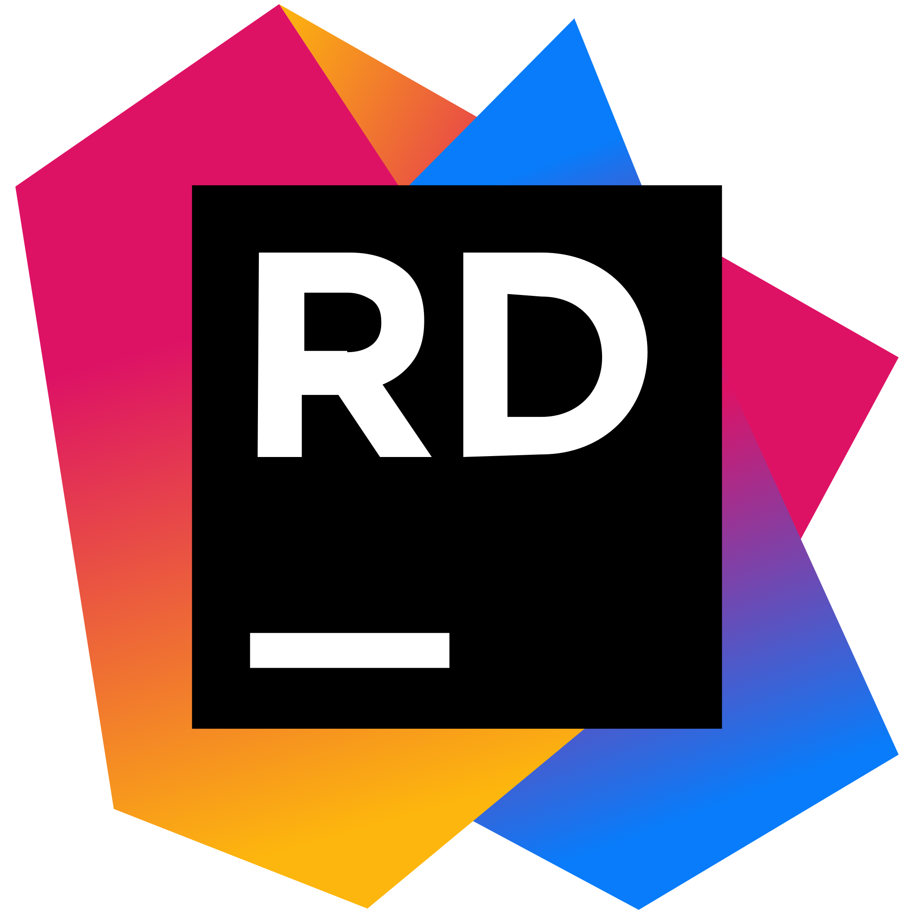
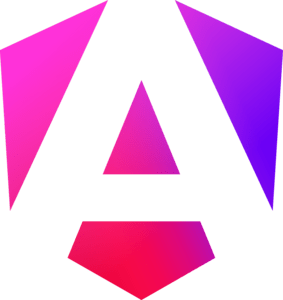
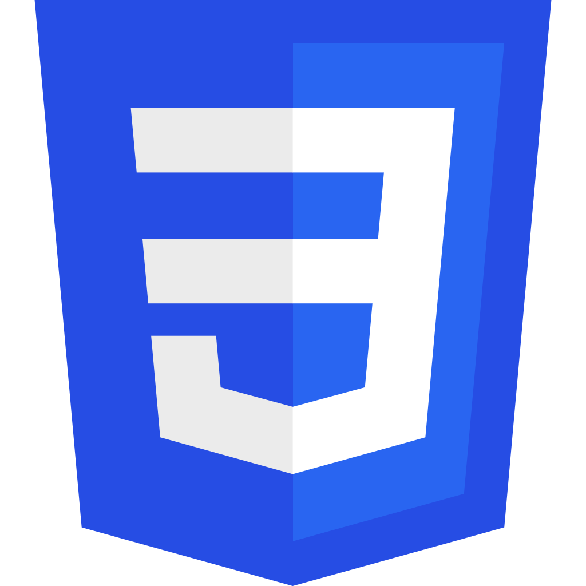
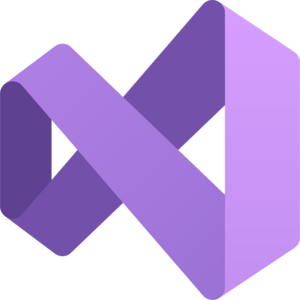
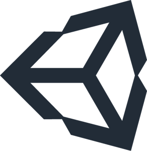
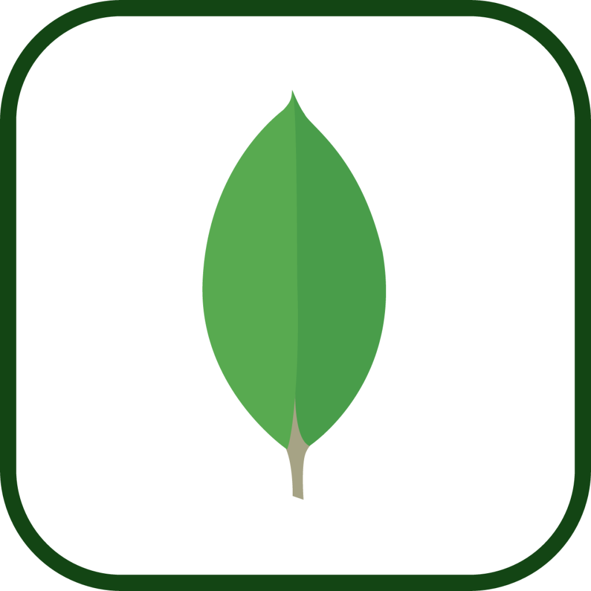

# Hello there! 

I'm **Pablo Meca**, a Software Engineer passionate about **backend development**, building clean APIs with **.NET C#**, and deploying services with **Docker**. I love writing **clear, maintainable code** designed for other developers, and I'm always exploring new technologies to learn and create exciting projects.

I work daily with .NET, Docker, databases and microservices. In my free time, I dive into **frontend development** (Angular, Astro) and experiment with personal projects, always curious and eager to improve.

📬 Let's connect and build something amazing:

## 🧑‍💻 Technologies

**Currently working with:**

**Learning:**

**Previously worked with:**

## 🔝 Featured Projects

  
  
  
  
  
  

## 🧑‍🎓 Undergraduate Thesis: Murcia VR

For my Bachelor's Thesis, I developed a **virtual reality app** to experience [the city of Murcia](https://www.google.com/search?q=murcia) and raise awareness about air quality. Built in **Unity** for the Meta Quest 2, it uses the **Bing Maps API** and connects to the [CARM API](https://www.carm.es/web/pagina) for real-time weather data.

You can view a full demo in the following video:

## 📈 Stats

---

Thanks for reading! 🚀 If you share my passion for tech, let’s connect and build something amazing together. Happy coding! 😊

### With ♥️ from [Spain 🇪🇸](https://www.google.com/search?q=spain)
